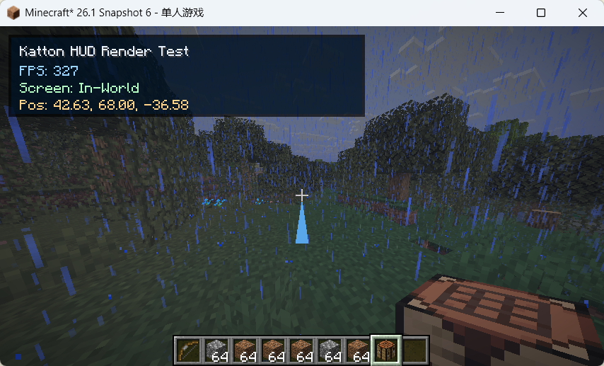
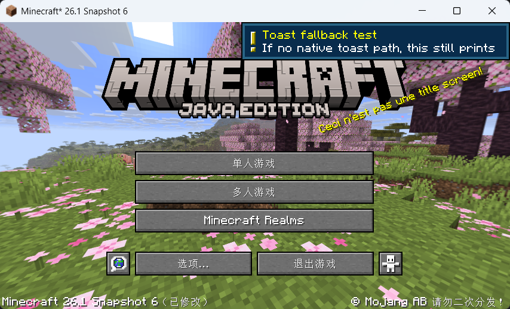
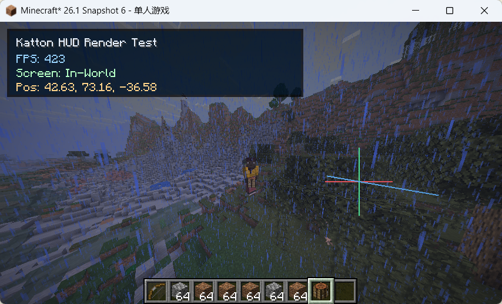

# Render 

Katton provides a simple API for rendering custom HUD elements and 3D shapes in the world.

>[!NOTE]
> Detailed information on all available rendering functions can be found in the [API documentation](../api/common/KattonClientRenderApi.md).

## Register a Renderer

To render elements on the HUD, you must register a HUD renderer using the [`registerHudRenderer`](../api/common/KattonClientRenderApi.md#registerhudrenderer) function. Provide a callback that will be invoked every frame to draw your UI elements. You can also specify a render layer and a priority level to control the order in which your renderer is executed.

```kotlin
fun hudRenderTestMain() {

    // Katton does not automatically unregister your renderer 
    // when a script is reloaded, so you must unregister it manually first.
    unregisterHudRenderer("katton:test:hud")

    registerHudRenderer("katton:test:hud", HudRenderLayer.FOREGROUND, 20) { ctx ->
        // Render elements using ctx
    }
}
```

World renderers are registered in a similar manner.

```kotlin

fun worldRenderTestMain() {
    unregisterWorldRenderer("katton:test:world")

    registerWorldRenderer("katton:test:world", WorldRenderLayer.NORMAL, 0) { ctx ->
        // Render something in the world using ctx
    }
}
```

## Examples

The following examples demonstrate the capabilities of the rendering API:

* Rendering custom text on the HUD:

```kotlin
import top.katton.api.HudRenderLayer
import top.katton.api.clientFps
import top.katton.api.clientPos
import top.katton.api.clientScreenName
import top.katton.api.clientTell
import top.katton.api.drawHudText
import top.katton.api.drawHudTexture
import top.katton.api.fillHudRect
import top.katton.api.once
import top.katton.api.registerHudRenderer
import top.katton.api.unregisterHudRenderer

fun hudRenderTestMain() {

    unregisterHudRenderer("katton:test:hud")

    registerHudRenderer("katton:test:hud", HudRenderLayer.FOREGROUND, 20) { ctx ->
        fillHudRect(ctx, 6, 6, 258, 64, 0xAA000000.toInt())
        fillHudRect(ctx, 8, 8, 256, 62, 0x66002244)

        drawHudText(ctx, "Katton HUD Render Test", 14, 14, 0xFFE8F1FF.toInt(), true)
        drawHudText(ctx, "FPS: ${clientFps() ?: -1}", 14, 28, 0xFF9BD5FF.toInt(), false)
        drawHudText(ctx, "Screen: ${clientScreenName() ?: "In-World"}", 14, 40, 0xFFB5FFC5.toInt(), false)

        val p = clientPos()
        if (p != null) {
            drawHudText(ctx, "Pos: %.2f, %.2f, %.2f".format(p.x, p.y, p.z), 14, 52, 0xFFFFD38A.toInt(), false)
        }
    }
    clientTell("[Katton] HUD render test script loaded")
}

val hudRenderTestEntryPoint = hudRenderTestMain()
```



* Sending messages and notifications to the player:

```kotlin
import net.minecraft.client.gui.components.toasts.SystemToast
import top.katton.api.clearClientOverlay
import top.katton.api.clientActionBar
import top.katton.api.clientNowPlaying
import top.katton.api.clientOverlay
import top.katton.api.clientSubtitle
import top.katton.api.clientTell
import top.katton.api.clientTitle
import top.katton.api.clientTitleTimes
import top.katton.api.clientToast
import top.katton.api.isClientInMenu
import top.katton.api.isInClientWorld
import top.katton.api.once
import top.katton.api.playClientSound
import top.katton.api.runOnClient
import top.katton.api.clientAddSystemToast

fun clientUiSmokeTestMain(){
    runOnClient {
        clientTell("[Katton] Starting client UI test")
        clientTitleTimes(fadeInTicks = 8, stayTicks = 30, fadeOutTicks = 10)
        clientTitle("Katton Client API")
        clientSubtitle("UI smoke test")

        clientOverlay("Overlay message from script", tinted = true)
        clientActionBar("Action bar notification")
        clientNowPlaying("Current music track hint")
        clientAddSystemToast(SystemToast.SystemToastId.NARRATOR_TOGGLE, "Toast fallback test", "If no specific toast path is found, this message will be displayed.")

        playClientSound("minecraft:entity.experience_orb.pickup", volume = 0.8f, pitch = 1.0f)

        // Clear overlay after a short delay (triggered via script execution)
        clearClientOverlay()
    }
}

val clientUiSmokeTestEntryPoint = clientUiSmokeTestMain()
```



* Drawing 3D shapes in the world:

```kotlin
import top.katton.api.WorldRenderLayer
import top.katton.api.clientPos
import top.katton.api.clientTell
import top.katton.api.drawBillboard3D
import top.katton.api.drawLine3D
import top.katton.api.registerWorldRenderer
import top.katton.api.unregisterWorldRenderer

fun worldRenderTestMain() {
    unregisterWorldRenderer("katton:test:world")

    registerWorldRenderer("katton:test:world", WorldRenderLayer.NORMAL, 0) { ctx ->
        val pos = clientPos() ?: return@registerWorldRenderer

        val x = pos.x
        val y = pos.y + 1.6
        val z = pos.z

        // X axis — red
        drawLine3D(
            ctx,
            x - 1.0, y, z,
            x + 1.0, y, z,
            argbColor = 0xFFFF5050.toInt(),
            lineWidth = 2.0f
        )

        // Y axis — green
        drawLine3D(
            ctx,
            x, y - 1.0, z,
            x, y + 1.0, z,
            argbColor = 0xFF50FF9E.toInt(),
            lineWidth = 2.0f
        )

        // Z axis — blue
        drawLine3D(
            ctx,
            x, y, z - 1.0,
            x, y, z + 1.0,
            argbColor = 0xFF5BB4FF.toInt(),
            lineWidth = 2.0f
        )

        // Camera-facing quad above head
        drawBillboard3D(
            ctx,
            x = x,
            y = y + 0.6,
            z = z,
            argbColor = 0xAAFFFF66.toInt(),
            size = 0.5f
        )
    }

    clientTell("[Katton] World render test script loaded")

}

private val worldRenderTest = worldRenderTestMain()
```

